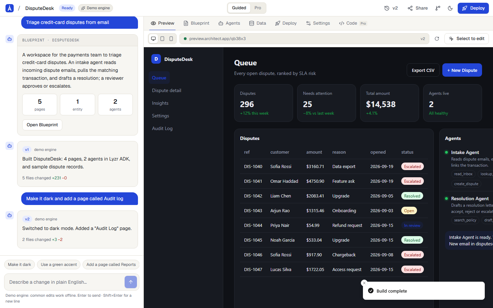

# Architect 2.0

**Describe it. Or code it. Ship the agents either way.**

A vibe-coding platform for business teams *and* developers, built as a take on the next version of
[architect.new](https://architect.new). One project, two lenses: a **Guided** lens for people who describe
outcomes, and a **Pro** lens for people who write code. It's the same source of truth underneath.



## What's in it

| Flow | What you can do | Status |
|---|---|---|
| Auth | Email + password (bcrypt), Google and GitHub OAuth, JWT sessions, protected routes | Working |
| Onboarding | Pick a lens (and a default agent framework), write the first prompt | Working |
| Home | Prompt box with framework picker, templates, project grid with live thumbnails, star/rename/delete | Working |
| **Plan** | The idea streams into a **Blueprint** (pages, data model, agents, integrations, theme) with wireframes. Nothing is built until you approve | Working (Claude or demo engine) |
| **Build** | "UI being built" view streams the code as it's written; each turn becomes a versioned checkpoint | Working |
| Iterate | Chat, or **click any element in the preview** to edit it. Per-turn file diff stats | Working |
| Code (Pro) | File tree, Monaco editor, save = checkpoint, new/delete files, diff against any version | Working |
| **Agent Studio** | Canvas (trigger → agent → tools → human approval), config, generated code in **6 frameworks**, playground with a trace | Working (runtime simulated; Claude answers when a key is set) |
| Data | Sample records, generated Postgres DDL, data-source options | Partly working |
| GitHub | Connect, create repo, push the checkpoint as a real commit; import a repo into a codebase map | Working (needs OAuth app) |
| Import | GitHub repo or a local folder → stack detection, codebase map, Pro lens | Working |
| **Deploy** | Pre-deploy checklist, streamed build log, **real public URL** (`/share/<slug>`), deployment history, one-click rollback | Working (hosted by the platform) |
| Settings | Encrypted env vars, integrations, API keys, REST API, usage meter, account deletion | Mostly working (integrations are designed flows) |
| Extras | ⌘K palette, dark mode, restore any checkpoint, pricing, responsive down to 375px | Working |

The full product thinking is in [`docs/PRODUCT.md`](docs/PRODUCT.md): a teardown of the nine reference platforms,
personas, design principles and flows. Decisions are in [`docs/DECISIONS.md`](docs/DECISIONS.md).

## Architecture

```
Next.js 15 (App Router, TS) ─ Tailwind v4 ─ Monaco ─ React Flow
        │
        ├─ Auth.js v5 (credentials + GitHub + Google, Prisma adapter, JWT)
        ├─ Prisma → Postgres (Neon in prod, embedded Postgres locally)
        ├─ /api/projects/[id]/{plan,build,chat,deploy}  →  Server-Sent Events
        │        └─ lib/engine: runPlan / runBuild / runEdit (async generators)
        │              ├─ Claude (structured Blueprint + streamed <<<FILE>>> blocks)
        │              └─ scripted demo engine (same event protocol, no key needed)
        ├─ lib/codegen: agent code for Lyzr ADK, LangGraph, CrewAI, OpenAI Agents SDK,
        │               Claude Agent SDK, AutoGen · Postgres DDL · README
        └─ /share/[slug]  →  generated app under CSP `sandbox` (opaque origin)
```

**Security notes.** Generated code is untrusted. The preview iframe runs with `sandbox` and no `allow-same-origin`,
and public apps are served with a CSP sandbox, so generated scripts can't read Architect cookies or call its API.
Every project route checks ownership. User file paths are validated against traversal. Env vars are AES-256-GCM
encrypted. API keys are stored as SHA-256 hashes. Logins are throttled and timing-equalised, and post-login
redirects are same-site only. AI usage is rate-limited per user, falling back to the demo engine at the limit.

## Run locally

```bash
npm install
cp .env.example .env.local     # set AUTH_SECRET (npx auth secret)
cp .env.local .env             # Prisma CLI reads .env
npm run db:local               # embedded Postgres on :5433 (keep running)
npm run db:push
npm run dev                    # http://localhost:3000
```

Set `ANTHROPIC_API_KEY` for real generation (model via `ARCHITECT_MODEL`, default `claude-opus-5`). Without it,
the demo engine runs the full flow offline.

## Tests

```bash
npm run test:cov   # 98+ unit tests (engine, parser, codegen, GitHub push/import, SSE, crypto, schemas)
npm run build && npm run e2e   # Playwright: golden path, auth, security, a11y (axe), mobile
```

The E2E golden path covers: sign up → onboarding → prompt → Blueprint edit → build → chat iteration →
click-to-edit → Pro code edit → Agent Studio run → framework switch → secrets → deploy → public URL with CSP →
restore → rollback. Security specs cover tenant isolation, sandboxing, path traversal, auth on every API, and
open redirects.

## Deploy

See [`docs/SETUP.md`](docs/SETUP.md) for Vercel + Neon + OAuth setup.
